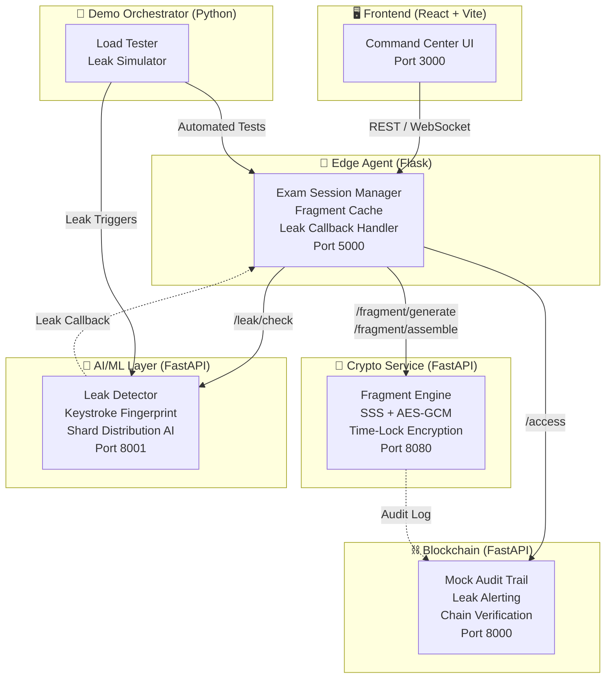

# 🔥 Project PHOENIX — Secure Exam Paper Distribution System

**P**rotected **H**igh-stakes **O**nline **E**xam **N**etwork with **I**ntelligent **X**-verification

A distributed, tamper-proof exam paper distribution system that uses **Shamir's Secret Sharing**, **AES-256 encryption**, **behavioral fingerprinting**, and a **blockchain audit trail** to prevent question paper leaks in high-stakes exams like NEET.

---

## 🏗️ Architecture


*(Insert Architecture Diagram PNG here)*



## 🌐 Command Center (Website)

The Frontend Command Center provides a comprehensive overview of the entire PHOENIX network, allowing administrators to monitor, audit, and simulate events across all microservices.

### Dashboard

*(Insert Dashboard Screenshot here)*
Real-time monitoring of active exam centers, network uptime, and fragmented questions across the distribution pipeline.

### Architecture Flow

*(Insert Architecture Flow Screenshot here)*
Interactive node-based graph demonstrating how fragments flow from the central Crypto Engine down to the local Edge Agents.

### Crypto Engine

*(Insert Crypto Engine Screenshot here)*
Watch the system dynamically shatter questions into encrypted fragments using Shamir's Secret Sharing and AES-256 encryption.

### Edge Agent Monitoring

*(Insert Edge Agent Screenshot here)*
Monitor sub-10 millisecond assembly latencies as students actively take their exams at local edge centers.

### AI/ML Leak Detector & Security Simulation

*(Insert Leak Detector Screenshot here)*
Simulate dark web leaks by injecting compromised hashes. Watch the AI instantly detect the leak and trigger a cryptographic cascade to regenerate fragments globally.

### Blockchain Audit Log

*(Insert Blockchain Audit Screenshot here)*
An immutable, timestamped ledger of every single fragment access, providing a completely transparent and tamper-proof chain of custody.

---

## 📦 Services

| Service | Tech | Port | Description |
|---------|------|------|-------------|
| **Crypto** | FastAPI | 8080 | Fragment generation, assembly, regeneration (SSS + AES-GCM) |
| **AI/ML** | FastAPI | 8001 | Leak detection, keystroke fingerprinting, shard distribution |
| **Blockchain** | FastAPI | 8000 | Immutable audit trail with leak alerting |
| **Frontend** | React + Vite | 3000 | Command Center dashboard |
| **Edge Agent** | Flask | 5000 | Local exam center — caches fragments, assembles papers |
| **Demo** | Python + Locust | N/A | Automated orchestrator for end-to-end load & leak testing |

---

## 🚀 Quick Start

### One-Command Start

```bash
docker-compose up --build
```

This command orchestrates all 6 services (including the demo orchestrator). Once running:

- **Frontend Command Center** → [http://localhost:3000](http://localhost:3000)
- **Edge Agent** → [http://localhost:5000/health](http://localhost:5000/health)
- **Crypto API** → [http://localhost:8080/health](http://localhost:8080/health)
- **AI/ML API** → [http://localhost:8001/docs](http://localhost:8001/docs)
- **Blockchain** → [http://localhost:8000/logs](http://localhost:8000/logs)

### Viewing Automated End-to-End Tests
The `demo` container automatically waits for the network to initialize and runs a Locust Load Test followed by a Leak Simulation. You can view the results live:
```bash
docker logs -f phoenix-demo
```

---

## 📁 Project Structure

```
Project-Phoenix-FAR_AWAY/
├── backend/                  # Crypto Fragment Engine (FastAPI)
│   ├── main.py               #   API endpoints
│   ├── crypto_engine.py       #   SSS + AES-GCM implementation
│   ├── Dockerfile
│   └── requirements.txt
├── aiml/                     # AI/ML Intelligence Layer (FastAPI)
│   ├── main_ai.py             #   API endpoints
│   ├── leak_detector.py       #   Dark web leak scanner
│   ├── shard_ai.py            #   Difficulty-based shard distribution
│   ├── fingerprint_trainer.py #   Keystroke dynamics model
│   ├── Dockerfile
│   └── requirements.txt
├── blockchain/               # Mock Blockchain Audit Trail (FastAPI)
│   ├── mock_chain.py          #   Blockchain implementation
│   ├── api/gateway.py         #   REST API
│   ├── Dockerfile
│   └── requirements.txt
├── frontend/                 # Command Center UI (React + Vite)
│   ├── src/                   #   React components & Pages
│   ├── public/                #   Static assets
│   ├── Dockerfile
│   ├── tailwind.config.js
│   └── package.json
├── edge-agent/               # Edge Agent (Flask)
│   ├── app.py                 #   Exam session manager
│   ├── cache.py               #   In-memory fragment cache
│   ├── regeneration_handler.py#   Leak response handler
│   ├── Dockerfile
│   └── requirements.txt
├── demo/                     # Demo & Testing Orchestrator
│   ├── leak_simulation.py     #   Full leak simulation script
│   ├── load_test.py           #   Locust load test
│   ├── run_demos.sh           #   Automated orchestrator script
│   ├── Dockerfile
│   └── requirements.txt
├── docker-compose.yml        # Full-stack orchestration
└── README.md                 # This file
```

---

## 🔒 Security Features

- **Shamir's Secret Sharing (SSS)**: Question papers split into *n* fragments with threshold *k*
- **AES-256-GCM Encryption**: Each question encrypted with a unique key
- **Time-Lock Encryption**: Fragments cannot be decrypted before the exam start time
- **Keystroke Fingerprinting**: ML-based behavioral biometrics for candidate verification
- **Dark Web Leak Detection**: AI scanner monitors for compromised fragment hashes
- **Blockchain Audit Trail**: Immutable log of all fragment accesses with anomaly detection
- **Fragment Regeneration**: Compromised fragments are replaced in real-time without exam disruption
