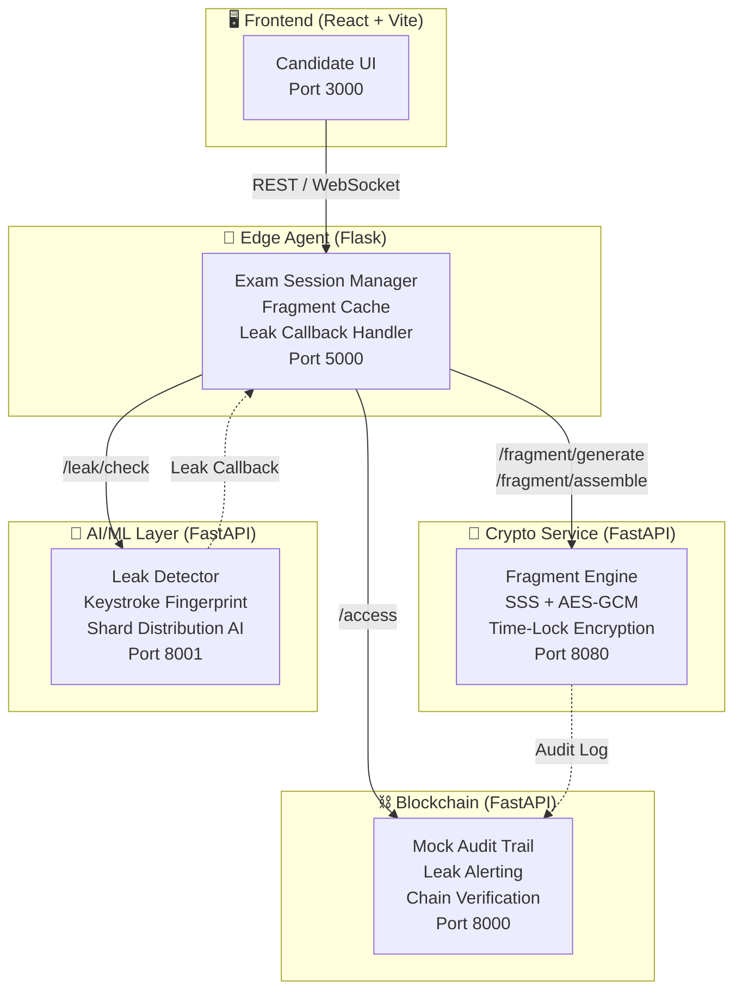

# 🔥 Project PHOENIX — Secure Exam Paper Distribution System

**P**rotected **H**igh-stakes **O**nline **E**xam **N**etwork with **I**ntelligent **X**-verification

A distributed, tamper-proof exam paper distribution system that uses **Shamir's Secret Sharing**, **AES-256 encryption**, **behavioral fingerprinting**, and a **blockchain audit trail** to prevent question paper leaks in high-stakes exams like NEET.

---

## 🏗️ Architecture



## 📦 Services

| Service | Tech | Port | Description |
|---------|------|------|-------------|
| **Crypto** | FastAPI | 8080 | Fragment generation, assembly, regeneration (SSS + AES-GCM) |
| **AI/ML** | FastAPI | 8001 | Leak detection, keystroke fingerprinting, shard distribution |
| **Blockchain** | FastAPI | 8000 | Immutable audit trail with leak alerting |
| **Frontend** | React + Vite | 3000 | Candidate exam interface with biometric auth |
| **Edge Agent** | Flask | 5000 | Local exam center — caches fragments, assembles papers |

---

## 🚀 Quick Start

### One-Command Start

```bash
docker-compose up --build
```

This starts all 5 services. Once running:

- **Frontend** → [http://localhost:3000](http://localhost:3000)
- **Edge Agent** → [http://localhost:5000/health](http://localhost:5000/health)
- **Crypto API** → [http://localhost:8080/health](http://localhost:8080/health)
- **AI/ML API** → [http://localhost:8001/docs](http://localhost:8001/docs)
- **Blockchain** → [http://localhost:8000/logs](http://localhost:8000/logs)

### Run Without Docker

```bash
# Terminal 1 — Crypto Service
cd backend && pip install -r requirements.txt
uvicorn main:app --port 8080

# Terminal 2 — AI/ML Service
cd aiml && pip install -r requirements.txt
uvicorn main_ai:app --port 8001

# Terminal 3 — Blockchain
cd blockchain
pip install fastapi uvicorn pydantic
uvicorn api.gateway:app --port 8000

# Terminal 4 — Edge Agent
cd edge-agent && pip install -r requirements.txt
python app.py

# Terminal 5 — Frontend
cd frontend && npm install && npm run dev
```

---

## 🧪 Demo: Leak Simulation

Simulates a NEET-style question paper leak and demonstrates the full response pipeline:

```bash
pip install requests
python demo/leak_simulation.py
```

**Expected output:**
```
[Step 1] Starting exam for candidate...
  ✓ Session created: a1b2c3d4...

[Step 2] Candidate answering questions...
  ✓ Q1: "Which of the following is the powerhouse..."  (2.34ms)
  ✓ Q2: "The pH of human blood is maintained at..."    (1.87ms)

[Step 3] Injecting leaked fragment hash into leak detector...
  ✓ Leak detector scanned hash f8e7a3b2... — probability: 0.0

[Step 4] Triggering fragment regeneration...
  [LEAK] Detected hash f8e7a3b2... -> Regenerating fragments -> Done. Exam continues.

[Step 5] Candidate continues exam after leak response...
  ✓ Q4: "The primary function of the loop of Henle..."  (1.92ms)
  ✓ Q5: "In which phase of mitosis do chromosomes..."   (2.01ms)
```

---

## 📊 Load Testing

Proves sub-10ms assembly latency under 100 concurrent candidates:

```bash
pip install locust
locust -f demo/load_test.py --headless -u 100 -r 10 --run-time 30s --host http://localhost:5000
```

Or use the Locust web UI:

```bash
locust -f demo/load_test.py --host http://localhost:5000
# Open http://localhost:8089
```

---

## 🔄 Reset

Clear all state and start fresh:

```bash
bash demo/reset.sh
docker-compose up --build
```

---

## 📁 Project Structure

```
Project-Phoenix-FAR_AWAY/
├── backend/                  # Crypto Fragment Engine (FastAPI)
│   ├── main.py               #   API endpoints
│   ├── crypto_engine.py       #   SSS + AES-GCM implementation
│   ├── Dockerfile
│   └── requirements.txt
├── aiml/                     # AI/ML Intelligence Layer (FastAPI)
│   ├── main_ai.py             #   API endpoints
│   ├── leak_detector.py       #   Dark web leak scanner
│   ├── shard_ai.py            #   Difficulty-based shard distribution
│   ├── fingerprint_trainer.py #   Keystroke dynamics model
│   ├── Dockerfile
│   └── requirements.txt
├── blockchain/               # Mock Blockchain Audit Trail (FastAPI)
│   ├── mock_chain.py          #   Blockchain implementation
│   ├── api/gateway.py         #   REST API
│   └── Dockerfile
├── frontend/                 # Candidate UI (React + Vite)
│   ├── src/                   #   React components
│   ├── nginx.conf             #   Production proxy config
│   ├── Dockerfile
│   └── package.json
├── edge-agent/               # Edge Agent (Flask)
│   ├── app.py                 #   Exam session manager
│   ├── cache.py               #   In-memory fragment cache
│   ├── regeneration_handler.py#   Leak response handler
│   ├── Dockerfile
│   └── requirements.txt
├── demo/                     # Demo & Testing
│   ├── leak_simulation.py     #   Full leak simulation script
│   ├── load_test.py           #   Locust load test
│   └── reset.sh               #   Environment reset script
├── docker-compose.yml        # Full-stack orchestration
└── README.md                 # This file
```

---

## 🔒 Security Features

- **Shamir's Secret Sharing (SSS)**: Question papers split into *n* fragments with threshold *k*
- **AES-256-GCM Encryption**: Each question encrypted with a unique key
- **Time-Lock Encryption**: Fragments cannot be decrypted before the exam start time
- **Keystroke Fingerprinting**: ML-based behavioral biometrics for candidate verification
- **Dark Web Leak Detection**: AI scanner monitors for compromised fragment hashes
- **Blockchain Audit Trail**: Immutable log of all fragment accesses with anomaly detection
- **Fragment Regeneration**: Compromised fragments are replaced in real-time without exam disruption
